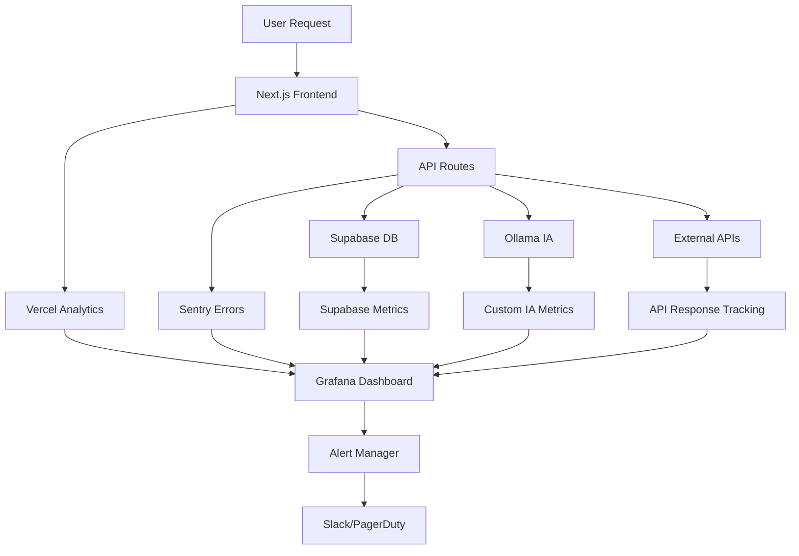

# 🔍 OBSERVABILITÉ & RÉSILIENCE - NutriCoach

## 🎯 STACK MONITORING PRODUCTION

### 🚨 Error Tracking & Performance
```bash
# Sentry - Error tracking
pnpm add @sentry/nextjs @sentry/profiling-node

# OpenTelemetry - Tracing distribué
pnpm add @opentelemetry/auto-instrumentations-node
pnpm add @opentelemetry/exporter-jaeger

# Vercel Analytics - Performance natif
pnpm add @vercel/analytics @vercel/speed-insights
```

### 📈 Business & User Analytics
```bash
# PostHog - Product analytics
pnpm add posthog-js

# Supabase Analytics - Database insights
# Built-in avec dashboard

# Hotjar - UX heatmaps & recordings
pnpm add hotjar
```

---

## 🔄 RETRY & FALLBACK STRATEGY

### 🤖 IA Menu Generation Resilience

```typescript
// Core service avec fallbacks multiples
class MenuGenerationService {
  private providers = [
    new OllamaProvider('localhost:4003'),
    new ClaudeProvider(process.env.CLAUDE_API_KEY),
    new FallbackProvider() // Templates pré-calculés
  ];

  async generateMenu(userProfile: UserProfile): Promise<MealPlan> {
    for (const provider of this.providers) {
      try {
        const menu = await provider.generate(userProfile);
        
        // Tracking success par provider
        this.analytics.track('menu_generation_success', {
          provider: provider.name,
          user_id: userProfile.id,
          generation_time: Date.now()
        });
        
        return menu;
      } catch (error) {
        // Log error sans bloquer
        console.error(`Provider ${provider.name} failed:`, error);
        
        // Sentry error tracking
        Sentry.captureException(error, {
          tags: { provider: provider.name },
          user: { id: userProfile.id }
        });
        
        // Continue vers provider suivant
        continue;
      }
    }
    
    throw new Error('All menu generation providers failed');
  }
}
```

### 🔄 Queue System pour Reliability

```typescript
// Bull Queue pour génération asynchrone
import Queue from 'bull';

const menuQueue = new Queue('menu generation', {
  redis: process.env.REDIS_URL,
  defaultJobOptions: {
    attempts: 3,
    backoff: 'exponential',
    delay: 2000
  }
});

// Job processing avec retry automatique
menuQueue.process('generate', async (job) => {
  const { userId, preferences } = job.data;
  
  try {
    const menu = await menuService.generateMenu(preferences);
    
    // Notification success
    await notificationService.send(userId, {
      type: 'menu_ready',
      data: { menuId: menu.id }
    });
    
    return menu;
  } catch (error) {
    // Auto-retry par Bull avec backoff
    throw error;
  }
});
```

---

## 📊 DASHBOARDS BUSINESS

### 📈 Métriques Critiques NutriCoach

```javascript
// Dashboard temps réel PostHog
const businessMetrics = {
  // Engagement
  'menus_generated_daily': posthog.capture('menu_generated'),
  'recipes_viewed_daily': posthog.capture('recipe_viewed'),
  'user_retention_7d': posthog.cohorts('weekly_retention'),
  
  // Performance
  'avg_generation_time': sentry.metrics('menu_generation_duration'),
  'api_response_time_p95': vercel.analytics('api_performance'),
  'error_rate_percentage': sentry.metrics('error_rate'),
  
  // Business
  'conversion_signup_to_first_menu': posthog.funnels('signup_funnel'),
  'customer_satisfaction_score': feedback.nps(),
  'monthly_active_users': posthog.insights('mau')
};
```

### 🚨 Alerting Strategy

```yaml
# alerts.yml - Règles d'alerting
rules:
  - name: "Menu Generation Critical"
    condition: "error_rate > 5% OR avg_time > 30s"
    channels: ["slack-critical", "pagerduty"]
    
  - name: "User Experience"
    condition: "satisfaction_score < 4.0 OR retention_7d < 40%"
    channels: ["slack-product", "email-team"]
    
  - name: "Infrastructure"
    condition: "cpu > 80% OR memory > 85% OR disk > 90%"
    channels: ["slack-ops", "pagerduty"]
```

---

## 🔍 HEALTH CHECKS AVANCES

### 🌡️ API Health Monitoring

```typescript
// /api/health/detailed route
export async function GET() {
  const healthChecks = await Promise.allSettled([
    // Database connectivity
    supabase.from('recipes').select('count').limit(1),
    
    // AI providers availability  
    ollamaClient.health(),
    claudeClient.ping(),
    
    // External services
    redis.ping(),
    fetch('/api/auth/session').then(r => r.ok),
    
    // Storage
    supabase.storage.from('images').list('', { limit: 1 })
  ]);
  
  const status = healthChecks.every(check => 
    check.status === 'fulfilled'
  ) ? 'healthy' : 'degraded';
  
  return Response.json({
    status,
    timestamp: new Date().toISOString(),
    checks: {
      database: healthChecks[0].status,
      ollama: healthChecks[1].status, 
      claude: healthChecks[2].status,
      redis: healthChecks[3].status,
      auth: healthChecks[4].status,
      storage: healthChecks[5].status
    },
    uptime: process.uptime(),
    memory: process.memoryUsage(),
    version: process.env.npm_package_version
  });
}
```

### 🔄 Circuit Breaker Pattern

```typescript
// Circuit breaker pour IA providers
class CircuitBreaker {
  private failures = 0;
  private lastFailure = 0;
  private state: 'CLOSED' | 'OPEN' | 'HALF_OPEN' = 'CLOSED';
  
  constructor(
    private threshold = 5,
    private timeout = 60000 // 1min
  ) {}
  
  async call<T>(fn: () => Promise<T>): Promise<T> {
    if (this.state === 'OPEN') {
      if (Date.now() - this.lastFailure > this.timeout) {
        this.state = 'HALF_OPEN';
      } else {
        throw new Error('Circuit breaker OPEN');
      }
    }
    
    try {
      const result = await fn();
      this.onSuccess();
      return result;
    } catch (error) {
      this.onFailure();
      throw error;
    }
  }
  
  private onSuccess() {
    this.failures = 0;
    this.state = 'CLOSED';
  }
  
  private onFailure() {
    this.failures++;
    this.lastFailure = Date.now();
    
    if (this.failures >= this.threshold) {
      this.state = 'OPEN';
    }
  }
}
```

---

## 📊 SETUP MONITORING MVP

### 🚀 Configuration Immediate

```bash
# 1. Setup Sentry
make setup-sentry

# 2. Configure PostHog
make setup-analytics

# 3. Health checks
make setup-health-monitoring

# 4. Alerting
make setup-alerts

# 5. Dashboard Grafana (optionnel)
make setup-grafana
```

### 📈 Métriques MVP Essentielles

```
🟢 Disponibilité:   >99.5% uptime
🟡 Performance:   <3s génération menu
🔴 Erreurs:       <1% error rate
🔵 Engagement:    >60% retention J7
🟠 Satisfaction: >4.0/5 rating
```

---

## 📊 ARCHITECTURE OBSERVABILITÉ

### 🔄 **Data Flow Monitoring**


### 🎯 **Tracing Distribué** 
```typescript
// OpenTelemetry setup complet
import { NodeSDK } from '@opentelemetry/sdk-node';
import { Resource } from '@opentelemetry/resources';
import { SemanticResourceAttributes } from '@opentelemetry/semantic-conventions';

const sdk = new NodeSDK({
  resource: new Resource({
    [SemanticResourceAttributes.SERVICE_NAME]: 'nutricoach-api',
    [SemanticResourceAttributes.SERVICE_VERSION]: '1.0.0',
    [SemanticResourceAttributes.DEPLOYMENT_ENVIRONMENT]: process.env.NODE_ENV
  }),
  traceExporter: new JaegerExporter({
    endpoint: process.env.JAEGER_ENDPOINT,
  }),
  instrumentations: [
    // Auto-instrument HTTP, Database, etc.
    getNodeAutoInstrumentations({
      '@opentelemetry/instrumentation-http': {
        requestHook: (span, request) => {
          span.setAttributes({
            'user.id': request.headers['x-user-id'],
            'request.size': request.headers['content-length']
          });
        }
      }
    })
  ]
});
```

---

## 🚨 INCIDENT RESPONSE FRAMEWORK

### ⚡ **Runbooks Automatisés**
```bash
# Incident Response Playbooks
/scripts/
├── runbooks/
│   ├── high-error-rate.sh       # >5% error rate
│   ├── slow-menu-generation.sh  # >30s génération  
│   ├── database-connection.sh   # DB connectivity
│   ├── ai-provider-down.sh      # Ollama/Claude fail
│   └── user-satisfaction.sh     # <4/5 rating

# Exemple: runbook automatique
./runbooks/high-error-rate.sh
# → Check recent deploys
# → Analyze error patterns
# → Auto-rollback si nécessaire  
# → Notify team avec context
```

### 📋 **Escalation Matrix**
```yaml
incident_severity:
  CRITICAL:
    - Menu generation down >5min
    - Data loss detected  
    - Security breach
    response_time: "5 minutes"
    escalation: ["dev-team", "pagerduty", "ceo"]
    
  HIGH:
    - Error rate >10%
    - Performance degradation >50%
    - Payment processing issues
    response_time: "15 minutes"  
    escalation: ["dev-team", "slack-critical"]
    
  MEDIUM:
    - User satisfaction <3.5/5
    - Feature usage drop >30%
    - External API rate limits
    response_time: "1 hour"
    escalation: ["product-team", "slack-alerts"]
    
  LOW:
    - Minor UI bugs
    - Non-critical feature requests
    - Documentation updates
    response_time: "24 hours"
    escalation: ["dev-team", "linear-tickets"]
```

---

## 📈 CUSTOM METRICS NUTRICOACH

### 🍽️ **Métrique Métier Spécifiques**
```typescript
// Métriques custom nutrition
class NutritionMetrics {
  // Business Impact Metrics
  static trackMenuGeneration(params: {
    userId: string,
    recipeCount: number,
    restrictions: string[],
    generationTime: number,
    success: boolean
  }) {
    posthog.capture('menu_generated', {
      ...params,
      timestamp: Date.now()
    });
    
    // Prometheus custom metrics
    menuGenerationHistogram.observe(
      { success: params.success.toString() }, 
      params.generationTime
    );
  }
  
  // Quality Metrics
  static trackNutritionalAccuracy(menuId: string, score: number) {
    posthog.capture('nutrition_accuracy', {
      menu_id: menuId,
      accuracy_score: score,
      timestamp: Date.now()
    });
  }
  
  // User Engagement
  static trackRecipeInteraction(action: 'view' | 'save' | 'share', params: {
    recipeId: string,
    userId: string,
    timeSpent?: number
  }) {
    posthog.capture(`recipe_${action}`, params);
  }
}
```

### 📊 **SLI/SLO Definitions**
```yaml
# Service Level Indicators & Objectives
slis:
  availability:
    description: "Pourcentage uptime API"
    measurement: "requests_success / total_requests"
    slo: "99.9%"
    
  menu_generation_latency:
    description: "Temps génération menu P95"
    measurement: "histogram_quantile(0.95, menu_generation_seconds)"
    slo: "<15 seconds"
    
  error_rate:
    description: "Taux erreur global"  
    measurement: "errors / total_requests"
    slo: "<0.5%"
    
  user_satisfaction:
    description: "Score satisfaction moyen"
    measurement: "avg(satisfaction_rating)"
    slo: ">4.2/5"
    
  feature_adoption:
    description: "% users utilisant génération menu"
    measurement: "users_using_feature / total_active_users"
    slo: ">80%"
```

---

## 🔍 OBSERVABILITÉ FRONTEND

### 📱 **Real User Monitoring**
```typescript
// RUM setup pour performance UX
import { getCLS, getFID, getFCP, getLCP, getTTFB } from 'web-vitals';

function sendToAnalytics(metric: Metric) {
  // Performance vitals tracking
  posthog.capture('web_vital', {
    metric_name: metric.name,
    value: metric.value,
    rating: metric.rating,
    page: window.location.pathname
  });
  
  // Core Web Vitals alerting
  if (metric.rating === 'poor') {
    console.warn(`Poor ${metric.name}: ${metric.value}`);
    
    // Alert si seuils critiques
    if (metric.name === 'LCP' && metric.value > 4000) {
      Sentry.captureMessage(`Critical LCP: ${metric.value}ms`, 'warning');
    }
  }
}

// Track all Core Web Vitals
getCLS(sendToAnalytics);
getFID(sendToAnalytics);  
getFCP(sendToAnalytics);
getLCP(sendToAnalytics);
getTTFB(sendToAnalytics);
```

### 🎨 **UX Analytics Avancées**
```typescript
// Heatmaps & User Session Recording
import { Hotjar } from '@hotjar/browser';

// Trigger recordings pour debug UX
function trackUXIssues() {
  // Record sessions avec problèmes
  if (document.querySelector('[data-error]')) {
    Hotjar.trigger('error_encountered');
  }
  
  // Track abandonment points
  window.addEventListener('beforeunload', () => {
    const currentStep = getCurrentOnboardingStep();
    if (currentStep < 5) {
      posthog.capture('onboarding_abandoned', {
        step: currentStep,
        time_spent: Date.now() - sessionStart
      });
    }
  });
}
```

---

## 🔄 DEPLOYMENT MONITORING

### 🚀 **Pre/Post Deploy Checks**
```bash
#!/bin/bash
# deploy-monitoring.sh

echo "🚀 Starting deployment monitoring..."

# Pre-deploy baseline
BASELINE_ERROR_RATE=$(curl -s "${METRICS_API}/error_rate")
BASELINE_RESPONSE_TIME=$(curl -s "${METRICS_API}/avg_response_time")

echo "📊 Baseline metrics:"
echo "Error rate: ${BASELINE_ERROR_RATE}%"
echo "Response time: ${BASELINE_RESPONSE_TIME}ms"

# Deploy application
echo "🔄 Deploying application..."
vercel deploy --prod

# Post-deploy validation (15min monitoring)
echo "⏱️ Monitoring deployment for 15 minutes..."
for i in {1..15}; do
  sleep 60
  
  ERROR_RATE=$(curl -s "${METRICS_API}/error_rate")
  RESPONSE_TIME=$(curl -s "${METRICS_API}/avg_response_time")
  
  # Alert if significant degradation
  if (( $(echo "$ERROR_RATE > $BASELINE_ERROR_RATE * 2" | bc -l) )); then
    echo "🚨 ERROR RATE SPIKE: ${ERROR_RATE}% (baseline: ${BASELINE_ERROR_RATE}%)"
    # Auto-rollback trigger
    vercel rollback
    exit 1
  fi
  
  echo "✅ Min ${i}: Error rate ${ERROR_RATE}%, Response time ${RESPONSE_TIME}ms"
done

echo "🎉 Deployment validated successfully!"
```

### 📊 **A/B Testing Monitoring**
```typescript
// Feature flag impact tracking
class FeatureMonitoring {
  static trackFeatureImpact(featureFlag: string, variant: string) {
    // Business metrics par variant
    const metrics = {
      variant,
      feature_flag: featureFlag,
      session_id: getSessionId(),
      user_id: getUserId()
    };
    
    // Track conversion impact
    posthog.featureFlag(featureFlag, {
      onFeatureFlag: (flag, variant) => {
        posthog.capture('feature_exposure', {
          ...metrics,
          variant
        });
      }
    });
    
    // Performance impact
    performance.mark(`feature_${featureFlag}_start`);
    
    return () => {
      performance.mark(`feature_${featureFlag}_end`);
      performance.measure(
        `feature_${featureFlag}`,
        `feature_${featureFlag}_start`,
        `feature_${featureFlag}_end`
      );
      
      const measure = performance.getEntriesByName(`feature_${featureFlag}`)[0];
      posthog.capture('feature_performance', {
        ...metrics,
        duration: measure.duration
      });
    };
  }
}
```

---

## 📋 MONITORING CHECKLIST MVP

### ✅ **Setup Priorité 1** *(Semaine 6)*
- [ ] Sentry error tracking configuré
- [ ] Vercel Analytics activé  
- [ ] PostHog events critiques trackés
- [ ] Health checks API implémentés
- [ ] Slack alerting basique setup

### ✅ **Setup Priorité 2** *(Semaine 7)*
- [ ] OpenTelemetry tracing distribué
- [ ] Custom business metrics
- [ ] Circuit breakers IA providers
- [ ] Runbooks incident response
- [ ] Dashboard Grafana/DataDog

### ✅ **Setup Priorité 3** *(Semaine 8)*
- [ ] Real User Monitoring frontend
- [ ] A/B testing monitoring  
- [ ] Deployment monitoring automatique
- [ ] SLI/SLO enforcement
- [ ] Advanced alerting rules

Cette stratégie garantit une **résilience maximale** pour les fonctionnalités critiques nutrition ! 🛡️