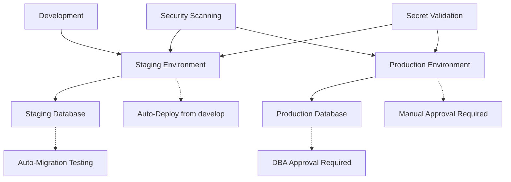
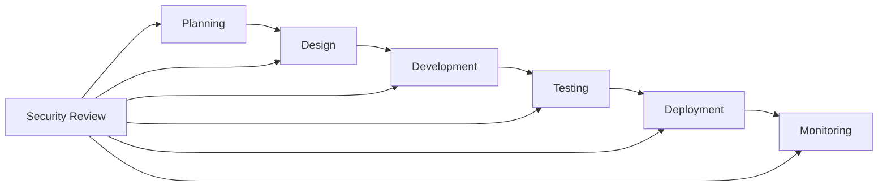

# 🔒 NutriCoach Security Guide

Complete security architecture and procedures guide for the NutriCoach platform with GitHub Environments isolation and comprehensive protection protocols.

## 📋 Table of Contents

1. [Security Architecture Overview](#security-architecture-overview)
2. [GitHub Environments Configuration](#github-environments-configuration)
3. [Secret Management](#secret-management)
4. [Security Workflows](#security-workflows)
5. [Monitoring & Compliance](#monitoring--compliance)
6. [Incident Response](#incident-response)
7. [Security Procedures](#security-procedures)
8. [Compliance Requirements](#compliance-requirements)
9. [Security Tools & Scripts](#security-tools--scripts)
10. [Best Practices](#best-practices)

---

## 🏗️ Security Architecture Overview

NutriCoach implements a multi-layered security architecture with complete isolation between environments and comprehensive protection mechanisms.

### Core Security Principles

- **🔐 Zero Trust Security**: Never trust, always verify
- **🛡️ Defense in Depth**: Multiple layers of security controls
- **🔄 Least Privilege Access**: Minimum necessary permissions
- **📊 Continuous Monitoring**: Real-time security monitoring
- **🚨 Incident Response**: Rapid detection and response
- **📋 Compliance by Design**: Built-in regulatory compliance

### Environment Isolation Strategy



---

## 🌐 GitHub Environments Configuration

### Environment Architecture

#### 1. Staging Environment (`staging`)
**Purpose**: Development testing and validation
- **Auto-deployment**: From `develop` branch
- **Approval**: None required
- **Wait time**: 5 minutes
- **Protection**: Basic security checks

#### 2. Production Environment (`production`)
**Purpose**: Live application serving users
- **Auto-deployment**: None (manual only)
- **Approval**: 2 reviewers required
- **Wait time**: 30 minutes
- **Protection**: Maximum security controls

#### 3. Staging Database (`staging-db`)
**Purpose**: Database schema and migration testing
- **Auto-deployment**: From `develop` branch
- **Approval**: None required
- **Wait time**: 2 minutes
- **Protection**: Migration safety checks

#### 4. Production Database (`production-db`)
**Purpose**: Production data operations
- **Auto-deployment**: None (manual only)
- **Approval**: 3 reviewers required (DBA + Security + DevOps)
- **Wait time**: 60 minutes
- **Protection**: Ultra-secure with mandatory approvals

### Environment Setup Instructions

#### Step 1: GitHub Repository Settings

1. Navigate to repository **Settings** → **Environments**
2. Create each environment using the provided YAML configurations
3. Configure protection rules for each environment
4. Set up required reviewers and teams

#### Step 2: Environment Protection Rules

**Staging Environment Protection:**
```yaml
required_reviewers: 0
wait_timer: 5
prevent_self_review: true
deployment_branch_policy:
  custom_branches: ["develop", "feature/*"]
```

**Production Environment Protection:**
```yaml
required_reviewers: 2
wait_timer: 30
prevent_self_review: true
required_reviewer_teams: ["devops-team", "senior-developers"]
deployment_branch_policy:
  protected_branches: true
```

**Production Database Protection:**
```yaml
required_reviewers: 3
wait_timer: 60
prevent_self_review: true
required_reviewer_teams: ["database-admin-team", "security-team", "senior-devops-team"]
deployment_branch_policy:
  protected_branches: true
```

#### Step 3: Access Control Configuration

**Team Setup:**
- `devops-team`: Infrastructure and deployment management
- `database-admin-team`: Database operations and migrations
- `security-team`: Security reviews and compliance
- `senior-developers`: Code and architecture reviews

---

## 🔐 Secret Management

### Secret Categories

#### 1. Deployment Secrets
- `VERCEL_TOKEN_*`: Vercel deployment authentication
- `VERCEL_ORG_ID`: Organization identifier
- `VERCEL_PROJECT_ID_*`: Environment-specific project IDs

#### 2. Database Secrets
- `SUPABASE_ACCESS_TOKEN`: Supabase API access
- `SUPABASE_PROJECT_REF_*`: Environment-specific project references
- `SUPABASE_DB_URL_*`: Database connection strings
- `SUPABASE_SERVICE_ROLE_KEY_*`: Service-level database access

#### 3. Application Secrets
- `JWT_SECRET_*`: JWT token signing keys
- `NEXTAUTH_SECRET`: NextAuth authentication secret
- `ENCRYPTION_KEY_*`: Data encryption keys

#### 4. External Service Secrets
- `OPENAI_API_KEY_*`: OpenAI API access
- `STRIPE_SECRET_KEY_*`: Stripe payment processing
- `SENDGRID_API_KEY`: Email service authentication
- `SENTRY_DSN_*`: Error tracking and monitoring

#### 5. Monitoring Secrets
- `DATADOG_API_KEY_*`: Performance monitoring
- `PAGER_DUTY_TOKEN_*`: Incident alerting
- `SLACK_WEBHOOK_URL`: Team notifications

### Secret Validation

Use the automated secret validation script:

```bash
# Validate staging secrets
./scripts/security/validate-secrets.sh staging

# Validate production secrets
./scripts/security/validate-secrets.sh production
```

**Validation Checks:**
- ✅ Secret presence and length validation
- ✅ Format pattern matching
- ✅ Strength analysis
- ✅ Environment-specific validation
- ✅ Security issue detection

### Secret Rotation

Automated secret rotation using the rotation script:

```bash
# Rotate all secrets in staging (dry run)
DRY_RUN=true ./scripts/security/secret-rotation.sh staging all

# Rotate JWT secrets in production
./scripts/security/secret-rotation.sh production jwt

# Force rotation of all production secrets
FORCE_ROTATION=true ./scripts/security/secret-rotation.sh production all
```

**Rotation Schedule:**
- **JWT Secrets**: Every 90 days
- **Database Passwords**: Every 180 days
- **API Keys**: Per service provider recommendations
- **Encryption Keys**: Every 365 days (with data migration)

### Secret Masking

Protect sensitive data in logs using the masking utility:

```bash
# Mask secrets in log file
./scripts/security/secret-masking.sh app.log masked.log

# Mask secrets from pipeline output
cat ci-output.log | ./scripts/security/secret-masking.sh > safe-output.log
```

---

## 🔄 Security Workflows

### Automated Security Checks

The comprehensive security workflow (`.github/workflows/security-checks.yml`) performs:

#### 1. Secret Detection (`secret-detection`)
- **TruffleHog**: Historical secret scanning
- **GitLeaks**: Real-time secret detection
- **Custom Validation**: Environment secret verification
- **Hardcoded Secret Check**: Source code analysis

#### 2. Dependency Scanning (`dependency-scan`)
- **NPM Audit**: Vulnerability assessment
- **Snyk Security**: Advanced dependency analysis
- **Trivy Scanner**: Comprehensive vulnerability detection
- **OSSAR Analysis**: Microsoft security scanning

#### 3. Code Security Analysis (`code-analysis`)
- **CodeQL**: GitHub's semantic code analysis
- **Semgrep**: Rule-based security scanning
- **ESLint Security**: JavaScript-specific security rules

#### 4. Infrastructure Security (`infrastructure-security`)
- **Terraform Security**: Infrastructure as code scanning
- **GitHub Actions Security**: Workflow configuration validation
- **Container Security**: Docker image vulnerability scanning

#### 5. Database Security (`database-security`)
- **SQL Analysis**: Migration safety validation
- **Supabase Security**: RLS policy verification
- **Schema Validation**: Database structure integrity

#### 6. API Security Testing (`api-security`)
- **OWASP ZAP**: Web application security testing
- **Endpoint Validation**: API security verification
- **Authentication Testing**: Security mechanism validation

#### 7. Compliance Check (`compliance-check`)
- **GDPR Compliance**: Privacy regulation validation
- **Security Headers**: HTTP security configuration
- **Documentation Requirements**: Compliance documentation

### Workflow Triggers

```yaml
# Automatic triggers
on:
  push:
    branches: [main, develop]
  pull_request:
    branches: [main, develop]
  schedule:
    - cron: '0 3 * * *'  # Daily at 3 AM UTC

# Manual triggers
workflow_dispatch:
  inputs:
    security_level: [quick, standard, comprehensive]
    environment: [staging, production]
```

### Security Gate Requirements

**Pull Request Requirements:**
- ✅ All security checks must pass
- ✅ No critical vulnerabilities detected
- ✅ Secret validation successful
- ✅ Code security analysis clean
- ✅ Dependency scan clear

**Production Deployment Requirements:**
- ✅ All PR requirements met
- ✅ Manual security review completed
- ✅ Change management approval
- ✅ Rollback plan documented
- ✅ Incident response plan ready

---

## 📊 Monitoring & Compliance

### Security Monitoring Stack

#### 1. Application Security
- **Sentry**: Error tracking and performance monitoring
- **Datadog**: Application performance monitoring
- **New Relic**: Full-stack observability

#### 2. Infrastructure Security
- **GitHub Security**: Repository security monitoring
- **Vercel Security**: Deployment security tracking
- **Supabase Security**: Database security monitoring

#### 3. Network Security
- **Cloudflare**: DDoS protection and WAF
- **Vercel Edge**: CDN security features
- **SSL/TLS Monitoring**: Certificate validation

#### 4. Access Security
- **GitHub Audit Logs**: Repository access tracking
- **Supabase Audit**: Database access monitoring
- **Vercel Activity**: Deployment activity logs

### Security Metrics

#### Key Security Indicators (KSIs)
- **Secret Exposure Rate**: 0 per month
- **Vulnerability Resolution Time**: < 24 hours
- **Security Scan Coverage**: 100%
- **Failed Authentication Attempts**: Monitored daily
- **Deployment Security Score**: > 95%

#### Compliance Metrics
- **GDPR Compliance Score**: 100%
- **Security Policy Adherence**: 100%
- **Audit Trail Completeness**: 100%
- **Data Encryption Coverage**: 100%
- **Access Control Compliance**: 100%

### Alerting Configuration

#### Critical Alerts (Immediate Response)
- 🚨 Secret exposure detected
- 🚨 Critical vulnerability found
- 🚨 Unauthorized access attempt
- 🚨 Data breach indicators
- 🚨 Production deployment failure

#### Warning Alerts (24-hour Response)
- ⚠️ High-severity vulnerabilities
- ⚠️ Failed security scans
- ⚠️ Suspicious user activity
- ⚠️ Performance security issues
- ⚠️ Compliance violations

#### Info Alerts (Weekly Review)
- ℹ️ Security scan reports
- ℹ️ Dependency updates available
- ℹ️ Security policy changes
- ℹ️ Training reminders
- ℹ️ Audit log summaries

---

## 🚨 Incident Response

### Incident Classification

#### Severity 1 (Critical)
- **Data breach confirmed**
- **Production system compromise**
- **Critical vulnerability actively exploited**
- **Complete service outage**

**Response Time**: Immediate (< 15 minutes)
**Escalation**: CEO, CTO, Security Lead

#### Severity 2 (High)
- **Potential data exposure**
- **Security control bypass**
- **High-risk vulnerability**
- **Partial service degradation**

**Response Time**: < 1 hour
**Escalation**: Security Team, DevOps Lead

#### Severity 3 (Medium)
- **Security policy violation**
- **Medium-risk vulnerability**
- **Failed security controls**
- **Suspicious activity detected**

**Response Time**: < 4 hours
**Escalation**: Security Team

#### Severity 4 (Low)
- **Minor security issues**
- **Policy clarification needed**
- **Low-risk vulnerabilities**
- **Security enhancement opportunities**

**Response Time**: < 24 hours
**Escalation**: Security Team (next business day)

### Incident Response Procedures

#### 1. Detection and Analysis (0-15 minutes)
```bash
# Immediate response checklist
1. Confirm incident authenticity
2. Classify severity level
3. Activate incident response team
4. Document initial findings
5. Preserve evidence
```

#### 2. Containment (15-60 minutes)
```bash
# Containment actions
1. Isolate affected systems
2. Revoke compromised credentials
3. Block malicious traffic
4. Implement temporary fixes
5. Prevent further damage
```

#### 3. Eradication (1-4 hours)
```bash
# Eradication steps
1. Remove malicious code/access
2. Patch vulnerabilities
3. Update security controls
4. Strengthen defenses
5. Validate system integrity
```

#### 4. Recovery (4-24 hours)
```bash
# Recovery process
1. Restore services safely
2. Monitor for reoccurrence
3. Validate security measures
4. Communicate with stakeholders
5. Document lessons learned
```

#### 5. Post-Incident (24-72 hours)
```bash
# Post-incident activities
1. Conduct thorough investigation
2. Update security procedures
3. Provide training updates
4. Implement improvements
5. File compliance reports
```

### Emergency Contacts

```yaml
# Incident Response Team
Incident Commander:
  Primary: "John Doe <john@nutricoach.com>"
  Secondary: "Jane Smith <jane@nutricoach.com>"

Security Lead:
  Primary: "Security Team <security@nutricoach.com>"
  Phone: "+1-555-SECURITY"

DevOps Lead:
  Primary: "DevOps Team <devops@nutricoach.com>"
  Phone: "+1-555-DEVOPS"

# External Contacts
Legal Counsel: "legal@nutricoach.com"
PR Team: "pr@nutricoach.com"
Insurance: "Cyber Insurance Provider"
Law Enforcement: "FBI Cyber Division (if required)"
```

---

## 🔧 Security Procedures

### Development Security Procedures

#### 1. Secure Development Lifecycle


#### 2. Code Review Security Checklist
- [ ] No hardcoded secrets or credentials
- [ ] Input validation implemented
- [ ] Authentication and authorization checks
- [ ] Secure error handling
- [ ] SQL injection prevention
- [ ] XSS protection measures
- [ ] CSRF protection enabled
- [ ] Secure communication (HTTPS)
- [ ] Data encryption at rest and in transit
- [ ] Proper logging without sensitive data

#### 3. Branch Protection Rules
```yaml
# Main branch protection
main:
  required_status_checks:
    - "security-checks"
    - "code-quality"
    - "tests"
  enforce_admins: true
  require_signed_commits: true
  dismiss_stale_reviews: true
  require_code_owner_reviews: true

# Develop branch protection
develop:
  required_status_checks:
    - "security-checks"
    - "tests"
  enforce_admins: false
  require_signed_commits: false
```

### Deployment Security Procedures

#### 1. Pre-Deployment Security Checklist
- [ ] Security scan results reviewed
- [ ] Vulnerability assessment completed
- [ ] Secrets validation passed
- [ ] Change management approval obtained
- [ ] Rollback plan documented
- [ ] Security team notification sent
- [ ] Compliance requirements verified
- [ ] Emergency contacts updated

#### 2. Deployment Security Gates
```yaml
staging_deployment:
  required_checks:
    - security_scan: "passed"
    - dependency_audit: "clean"
    - secret_validation: "passed"
  auto_deploy: true

production_deployment:
  required_checks:
    - security_scan: "passed"
    - manual_security_review: "approved"
    - change_management: "approved"
    - rollback_plan: "documented"
  auto_deploy: false
  approval_required: true
```

#### 3. Post-Deployment Verification
- [ ] Health checks passed
- [ ] Security headers validated
- [ ] Authentication systems functional
- [ ] Error tracking operational
- [ ] Performance monitoring active
- [ ] Backup systems verified
- [ ] Incident response team notified

### Access Management Procedures

#### 1. User Access Provisioning
```yaml
access_request_process:
  1. Request submitted via approved channels
  2. Manager approval required
  3. Security team review
  4. Principle of least privilege applied
  5. Time-limited access granted
  6. Access logged and monitored

access_review_schedule:
  quarterly: "All access permissions"
  annually: "Complete access audit"
  immediate: "Role changes or termination"
```

#### 2. Privileged Access Management
```yaml
privileged_access:
  production_access:
    - Multi-factor authentication required
    - Time-limited sessions
    - All actions logged
    - Approval workflow required
    - Regular access reviews

  database_access:
    - Database administrator approval
    - Purpose justification required
    - Session recording enabled
    - Query logging active
    - Regular audit reviews
```

---

## 📋 Compliance Requirements

### Regulatory Compliance

#### 1. GDPR (General Data Protection Regulation)
**Requirements:**
- ✅ Data minimization principles
- ✅ Consent management system
- ✅ Right to be forgotten implementation
- ✅ Data portability features
- ✅ Privacy by design architecture
- ✅ Data breach notification procedures
- ✅ Data protection impact assessments

**Implementation:**
```typescript
// Privacy controls example
interface PrivacyControls {
  consentManagement: ConsentManager;
  dataMinimization: DataMinimizer;
  rightToBeForgotten: DataDeletion;
  dataPortability: DataExporter;
  privacyByDesign: PrivacyFramework;
}
```

#### 2. CCPA (California Consumer Privacy Act)
**Requirements:**
- ✅ Consumer rights disclosure
- ✅ Data collection transparency
- ✅ Opt-out mechanisms
- ✅ Non-discrimination policies
- ✅ Third-party data sharing controls

#### 3. SOC 2 (Service Organization Control 2)
**Trust Principles:**
- ✅ **Security**: Protection against unauthorized access
- ✅ **Availability**: System operational availability
- ✅ **Processing Integrity**: System processing completeness
- ✅ **Confidentiality**: Information confidentiality
- ✅ **Privacy**: Personal information protection

### Security Standards Compliance

#### 1. OWASP Top 10 Protection
- ✅ **A01 - Broken Access Control**: Role-based access controls
- ✅ **A02 - Cryptographic Failures**: Strong encryption implementation
- ✅ **A03 - Injection**: Parameterized queries and input validation
- ✅ **A04 - Insecure Design**: Security by design principles
- ✅ **A05 - Security Misconfiguration**: Automated security configuration
- ✅ **A06 - Vulnerable Components**: Dependency vulnerability scanning
- ✅ **A07 - Authentication Failures**: Multi-factor authentication
- ✅ **A08 - Software Integrity Failures**: Code signing and verification
- ✅ **A09 - Logging Failures**: Comprehensive security logging
- ✅ **A10 - Server-Side Request Forgery**: SSRF protection measures

#### 2. NIST Cybersecurity Framework
**Core Functions:**
- **Identify**: Asset and risk management
- **Protect**: Access control and data security
- **Detect**: Continuous monitoring and detection
- **Respond**: Response planning and communications
- **Recover**: Recovery planning and improvements

### Compliance Monitoring

#### 1. Audit Trail Requirements
```yaml
audit_requirements:
  data_access:
    - User identification
    - Timestamp
    - Action performed
    - Data accessed
    - Source IP address
    - Result (success/failure)

  system_changes:
    - Change description
    - Implementer identification
    - Approval documentation
    - Rollback procedures
    - Risk assessment

  security_events:
    - Event classification
    - Detection timestamp
    - Response actions
    - Resolution time
    - Lessons learned
```

#### 2. Compliance Reporting
- **Monthly**: Security metrics dashboard
- **Quarterly**: Compliance assessment report
- **Annually**: Full security audit
- **As-needed**: Incident response reports

---

## 🛠️ Security Tools & Scripts

### Available Security Scripts

#### 1. Secret Validation (`validate-secrets.sh`)
```bash
# Validate secrets for specific environment
./scripts/security/validate-secrets.sh staging
./scripts/security/validate-secrets.sh production

# Features:
# - Secret presence validation
# - Format and strength checking
# - Environment-specific validation
# - Security issue detection
# - Comprehensive reporting
```

#### 2. Secret Masking (`secret-masking.sh`)
```bash
# Mask secrets in files or streams
./scripts/security/secret-masking.sh input.log output.log
cat logs/app.log | ./scripts/security/secret-masking.sh

# Features:
# - Pattern-based secret detection
# - Safe data preservation
# - Multiple masking strategies
# - Validation and reporting
```

#### 3. Secret Rotation (`secret-rotation.sh`)
```bash
# Rotate secrets with validation
./scripts/security/secret-rotation.sh production jwt
DRY_RUN=true ./scripts/security/secret-rotation.sh staging all

# Features:
# - Automated secret generation
# - Strength validation
# - Backup and rollback
# - Deployment integration
```

### Security GitHub Actions

#### 1. Security Checks Workflow
```yaml
# .github/workflows/security-checks.yml
name: 🔒 Security Checks
on: [push, pull_request, schedule]

jobs:
  secret-detection: # TruffleHog, GitLeaks
  dependency-scan: # NPM Audit, Snyk, Trivy
  code-analysis: # CodeQL, Semgrep, ESLint
  infrastructure-security: # Terraform, GitHub config
  database-security: # SQL analysis, migration safety
  api-security: # OWASP ZAP, endpoint testing
  compliance-check: # GDPR, security headers
```

#### 2. Deployment Security Integration
```yaml
# Production deployment with security gates
production-deploy:
  needs: [security-checks]
  environment: production
  if: ${{ needs.security-checks.result == 'success' }}
```

### Monitoring Tools Integration

#### 1. Sentry Configuration
```javascript
// Sentry security monitoring
import * as Sentry from "@sentry/nextjs";

Sentry.init({
  dsn: process.env.SENTRY_DSN_PRODUCTION,
  tracesSampleRate: 1.0,
  beforeSend(event) {
    // Mask sensitive data before sending
    return maskSensitiveData(event);
  }
});
```

#### 2. Security Headers Configuration
```javascript
// next.config.js - Security headers
const securityHeaders = [
  {
    key: 'Content-Security-Policy',
    value: "default-src 'self'; script-src 'self' 'unsafe-eval';"
  },
  {
    key: 'X-Frame-Options',
    value: 'DENY'
  },
  {
    key: 'X-Content-Type-Options',
    value: 'nosniff'
  },
  {
    key: 'Referrer-Policy',
    value: 'strict-origin-when-cross-origin'
  }
];
```

---

## ✅ Best Practices

### Development Security Best Practices

#### 1. Secure Coding Guidelines
```typescript
// ✅ Good: Input validation
function validateEmail(email: string): boolean {
  const emailRegex = /^[^\s@]+@[^\s@]+\.[^\s@]+$/;
  return emailRegex.test(email) && email.length <= 254;
}

// ✅ Good: Parameterized queries
const user = await supabase
  .from('users')
  .select('*')
  .eq('id', userId) // Parameterized
  .single();

// ❌ Bad: String concatenation
const query = `SELECT * FROM users WHERE id = '${userId}'`; // SQL injection risk
```

#### 2. Authentication Best Practices
```typescript
// ✅ Good: Secure session management
import { createServerSupabaseClient } from '@supabase/auth-helpers-nextjs';

export const getServerSideProps = async (ctx) => {
  const supabase = createServerSupabaseClient(ctx);
  const { data: { session } } = await supabase.auth.getSession();
  
  if (!session) {
    return { redirect: { destination: '/login', permanent: false } };
  }
  
  return { props: { session } };
};
```

#### 3. Data Protection Best Practices
```typescript
// ✅ Good: Data encryption
import CryptoJS from 'crypto-js';

const encryptSensitiveData = (data: string): string => {
  const key = process.env.ENCRYPTION_KEY_PRODUCTION;
  return CryptoJS.AES.encrypt(data, key).toString();
};

const decryptSensitiveData = (encryptedData: string): string => {
  const key = process.env.ENCRYPTION_KEY_PRODUCTION;
  const bytes = CryptoJS.AES.decrypt(encryptedData, key);
  return bytes.toString(CryptoJS.enc.Utf8);
};
```

### Deployment Security Best Practices

#### 1. Environment Separation
```yaml
# ✅ Good: Environment-specific secrets
staging:
  SUPABASE_PROJECT_REF: "staging-ref"
  SUPABASE_ANON_KEY: "staging-anon-key"

production:
  SUPABASE_PROJECT_REF: "production-ref"
  SUPABASE_ANON_KEY: "production-anon-key"
```

#### 2. Security Headers Implementation
```typescript
// middleware.ts - Security middleware
import { NextResponse } from 'next/server';
import type { NextRequest } from 'next/server';

export function middleware(request: NextRequest) {
  const response = NextResponse.next();
  
  // Security headers
  response.headers.set('X-Frame-Options', 'DENY');
  response.headers.set('X-Content-Type-Options', 'nosniff');
  response.headers.set('Referrer-Policy', 'strict-origin-when-cross-origin');
  
  return response;
}
```

#### 3. Error Handling Best Practices
```typescript
// ✅ Good: Secure error handling
export default function handler(req: NextRequest) {
  try {
    // Process request
    return NextResponse.json({ success: true });
  } catch (error) {
    // Log detailed error internally
    console.error('Internal error:', error);
    
    // Return generic error to client
    return NextResponse.json(
      { error: 'An internal error occurred' },
      { status: 500 }
    );
  }
}
```

### Monitoring Best Practices

#### 1. Security Logging
```typescript
// Security event logging
const logSecurityEvent = (event: SecurityEvent) => {
  const logEntry = {
    timestamp: new Date().toISOString(),
    event_type: event.type,
    user_id: event.userId,
    ip_address: event.ipAddress,
    user_agent: event.userAgent,
    action: event.action,
    resource: event.resource,
    result: event.result,
    session_id: event.sessionId
  };
  
  // Send to security monitoring system
  console.log('SECURITY_EVENT:', JSON.stringify(logEntry));
};
```

#### 2. Performance Security Monitoring
```typescript
// Monitor for security-related performance issues
const monitorSecurityPerformance = () => {
  // Monitor authentication latency
  // Monitor encryption/decryption performance
  // Monitor database query performance
  // Monitor API response times
};
```

### Team Security Best Practices

#### 1. Security Training Requirements
- **Monthly**: Security awareness training
- **Quarterly**: Incident response drills
- **Annually**: Comprehensive security certification
- **Ongoing**: Security best practices updates

#### 2. Code Review Security Focus
- [ ] Security vulnerability assessment
- [ ] Authentication and authorization review
- [ ] Input validation verification
- [ ] Error handling evaluation
- [ ] Logging and monitoring check
- [ ] Dependency security review

#### 3. Access Management
- **Principle of Least Privilege**: Minimum necessary access
- **Regular Access Reviews**: Quarterly access audits
- **Time-Limited Access**: Expiring permissions
- **Multi-Factor Authentication**: Required for all accounts
- **Strong Password Policy**: Enforced password requirements

---

## 📞 Support and Resources

### Internal Contacts
- **Security Team**: security@nutricoach.com
- **DevOps Team**: devops@nutricoach.com
- **Development Team**: dev@nutricoach.com
- **Compliance Team**: compliance@nutricoach.com

### External Resources
- [OWASP Security Guidelines](https://owasp.org/)
- [NIST Cybersecurity Framework](https://www.nist.gov/cyberframework)
- [GitHub Security Best Practices](https://docs.github.com/en/code-security)
- [Supabase Security Documentation](https://supabase.com/docs/guides/platform/security)

### Emergency Procedures
1. **Immediate**: Contact incident commander
2. **Critical**: Call security hotline: +1-555-SECURITY
3. **After Hours**: Page on-call security team
4. **Legal**: Contact legal counsel for data breaches

---

**📝 Document Information**
- **Last Updated**: $(date)
- **Version**: 1.0
- **Next Review**: $(date -d '+3 months')
- **Approval**: Security Team, DevOps Team, Compliance Team

*This document is confidential and intended for authorized personnel only.*